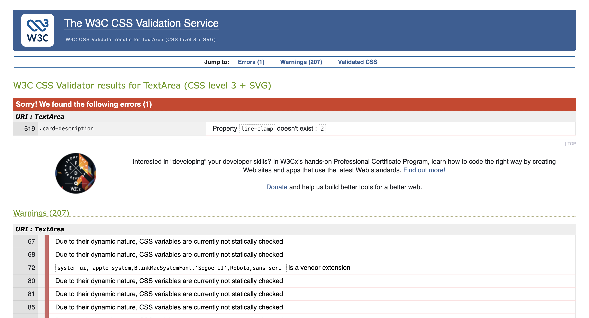
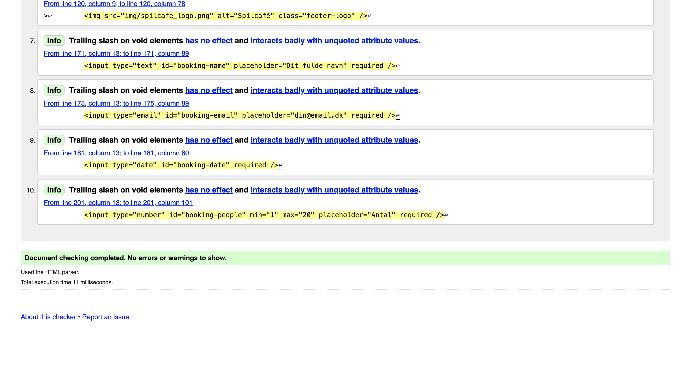

# SpilCaféen

## Kort beskrivelse af projektet

SpilCaféen er en responsiv og interaktiv hjemmeside, hvor brugeren kan se en oversigt over brætspil og booke et bord i en spilcafé.

Formålet med projektet er at gøre det nemt for gæster at finde et spil, der passer til deres ønsker. Brugeren kan filtrere spillene efter forskellige kategorier, søge efter spil, læse mere om hvert spil og sende en bordbooking.

### Teknologier

Projektet er udviklet med:

- HTML5 til sidens struktur
- CSS3 til sidens design og responsive layout
- JavaScript til funktionalitet og brugerinteraktion
- JSON til data om spillene

### Hvad kan brugeren gøre på siden?

Brugeren kan:

- se en oversigt over caféens brætspil
- søge efter spil
- filtrere efter genre, antal spillere, alder, sværhedsgrad og spilletid
- sortere efter titel, rating, spilletid, antal spillere, alder og anmeldelser
- klikke på et spil og se flere detaljer
- trykke på en stjerne ved et spil
- nulstille alle filtre
- booke et bord gennem en formular
- gå tilbage til toppen af siden med en knap

### Data i projektet

Projektet arbejder med data om brætspil. Spildataene hentes fra filen `movies.json` og vises dynamisk på hjemmesiden ved hjælp af JavaScript.

Hvert spil indeholder eksempelvis titel, genre, beskrivelse, billede, rating, antal anmeldelser, antal spillere, alder, spilletid og sværhedsgrad.

---

## Fil- og mappestruktur

```text
projektmappe/
├── index.html
├── app.css
├── app.js
├── movies.json
├── README.md
├── font/
│   └── SHOWG.TTF
└── img/
    ├── spilcafe_logo.png
    └── billeder-af-spil
```

## Beskrivelse af filerne 

### `index.html`

Filen `index.html` indeholder hjemmesidens struktur og indhold. Den indeholder blandt andet:

- en header med logo, titel og bookingknap
- et filter- og søgeområde
- et område til visning af spil
- en footer med lokationer og sociale medier
- en dialogboks med information om et valgt spil
- en dialogboks med bookingformular
- en knap til at gå tilbage til toppen af siden

### `app.css`

Filen `app.css` indeholder hjemmesidens design og layout. Her styles blandt andet:

- farver, skrifttyper og afstande
- header og footer
- filtre og søgefelt
- spilkort
- dialogbokse
- bookingformular
- mobil- og tabletvisning

### `app.js`

Filen `app.js` indeholder hjemmesidens funktionalitet. JavaScript-filen bruges til at:

- hente spil fra `movies.json`
- oprette spilkort dynamisk
- filtrere, sortere og søge i spillene
- åbne spildetaljer
- håndtere stjerne-rating
- åbne og behandle bookingformularen
- nulstille filtre
- styre tilbage-til-toppen-knappen

### `movies.json`

Filen `movies.json` indeholder oplysninger om de forskellige brætspil. Dataene ligger separat fra HTML-filen, så spillene nemt kan ændres eller udvides uden at ændre sidens struktur.

### `img/`

Mappen `img` indeholder billeder til projektet, for eksempel logoet og billeder af de enkelte spil.

### `font/`

Mappen `font` indeholder den lokale skrifttype `SHOWG.TTF`, som bruges til overskrifter på hjemmesiden.

### Hvorfor har jeg valgt denne struktur?

Jeg har valgt at opdele projektet i separate filer for HTML, CSS, JavaScript og JSON. Det gør projektet mere overskueligt, fordi sidens struktur, design, funktionalitet og data ikke blandes sammen.

Denne opdeling gør det også lettere at finde fejl og arbejde videre med projektet senere.

---

## Validering af CSS

Jeg har valideret CSS-filen `app.css` med værktøjet **W3C CSS Validation Service**:

[W3C CSS Validator](https://jigsaw.w3.org/css-validator/)



Validatoren viste én fejl i min CSS. Fejlen var i klassen `.card-description`, hvor jeg havde brugt egenskaben `line-clamp`:

```css
.card-description {
  line-clamp: 2;
}
```

Validatoren viste fejlen:

```text
Property line-clamp doesn't exist: 2
```

Validatoren viste en fejl ved `line-clamp`, fordi egenskaben ikke blev accepteret. Da jeg fjernede den, gav den browser-specifikke løsning med `-webkit-line-clamp` stadig problemer i valideringen. Jeg valgte derfor en løsning med `max-height` og `overflow: hidden`, som begrænser højden på beskrivelsen uden at bruge browser-specifikke egenskaber.

```css
.card-description {
  min-height: 2.5rem;
  max-height: 2.5rem;
  font-size: 0.78rem;
  color: var(--text-muted);
  line-height: 1.55;
  margin-bottom: var(--sp-3);
  overflow: hidden;
}
```

Validatoren viste også en række advarsler. Mange af advarslerne skyldes, at jeg bruger CSS-variabler, for eksempel:

```css
background: var(--surface);
color: var(--text);
```

CSS-validatoren oplyser, at CSS-variabler ikke kontrolleres statisk på samme måde som almindelige værdier. CSS-variablerne er stadig gyldige og bruges for at gøre designet mere ensartet og nemmere at vedligeholde.

### Resultat af CSS-validering

- **Valideret fil:** `app.css`
- **Værktøj:** W3C CSS Validation Service
- **Fejl:** Validatoren fandt én fejl: egenskaben `line-clamp` blev ikke accepteret.
- **Rettelse:** Jeg fjernede `line-clamp: 2;` og valgte løsningen med `max-height` og `overflow: hidden`
- **Advarsler:** Validatoren viste advarsler om CSS-variabler og enkelte browser-/systemspecifikke egenskaber. Disse er bevidst anvendt i designet.

---

## Validering af HTML

Jeg har valideret HTML-filen `index.html` med værktøjet **W3C Markup Validation Service**:

[W3C HTML Validator](https://validator.w3.org/)



Valideringen bruges til at kontrollere, om hjemmesidens HTML-struktur er korrekt opbygget, og om elementer og attributter er anvendt rigtigt.

I projektet bruger jeg semantiske HTML-elementer som:

```html
<header>
  ...
</header>

<main>
  ...
</main>

<footer>
  ...
</footer>
```

Disse elementer gør koden mere overskuelig og hjælper med at beskrive sidens opbygning tydeligt.

Jeg bruger også `dialog`-elementer til at vise spildetaljer og bookingformularen:

```html
<dialog id="booking-dialog">
  ...
</dialog>

<dialog id="movie-dialog">
  ...
</dialog>
```

### Resultat af HTML-validering

- **Valideret fil:** `index.html`
- **Værktøj:** W3C Markup Validation Service
- **Fejl/advarsler:** Validatoren viste ingen fejl eller advarsler. Den viste kun info-beskeder om afsluttende skråstreger på tomme HTML-elementer. Da dette ikke er fejl i projektet, påvirker det ikke sidens funktion.


---

## JavaScript-datastruktur

Projektets spildata hentes fra filen `movies.json` og gemmes i JavaScript i et array:

```javascript
let allGames = [];
```

Arrayet indeholder objekter, hvor hvert objekt repræsenterer ét brætspil.

### Eksempel på et spilobjekt

```json
{
  "title": "Catan",
  "genre": "Strategi",
  "description": "Et strategisk spil om handel og ressourcer.",
  "longDescription": "En længere beskrivelse af spillet.",
  "image": "img/catan.jpg",
  "rating": 4.5,
  "votes": 32,
  "players": {
    "min": 3,
    "max": 4
  },
  "age": 10,
  "playtime": 60,
  "difficulty": "Mellem"
}
```

### Properties i hvert objekt

| Property | Beskrivelse |
| --- | --- |
| `title` | Spillets titel |
| `genre` | Spillets kategori eller genre |
| `description` | Kort beskrivelse af spillet |
| `longDescription` | Længere beskrivelse til detaljevisning |
| `image` | Sti til spillets billede |
| `rating` | Spillets bedømmelse |
| `votes` | Antal anmeldelser |
| `players.min` | Mindste antal spillere |
| `players.max` | Største antal spillere |
| `age` | Anbefalet minimumsalder |
| `playtime` | Spilletid i minutter |
| `difficulty` | Spillets sværhedsgrad |

### Hvorfor passer datastrukturen til projektet?

Denne datastruktur passer godt til projektet, fordi alle spillene har de samme typer oplysninger.

Ved at bruge et array med objekter kan jeg nemt:

- vise alle spillene på hjemmesiden
- filtrere spillene efter bestemte værdier
- sortere spillene
- søge i oplysningerne
- åbne en detaljevisning for ét bestemt spil

---

## Eksempel på JavaScript-kode

Et vigtigt stykke kode i projektet er funktionen `applyFiltersAndSort()`. Funktionen bliver kaldt, når brugeren søger efter et spil, vælger et filter eller ændrer sorteringen.

```javascript
function applyFiltersAndSort() {
  updateActiveFilters();

  const selectedGenre = genreSelect.value;
  const selectedPlayers = playersSelect.value;
  const selectedAge = ageSelect.value;
  const selectedDifficulty = difficultySelect.value;
  const selectedPlaytime = playtimeSelect.value;
  const searchValue = searchInput.value.trim().toLowerCase();
  const sortOption = sortSelect.value;

  let filtered = allGames.filter(game => {
    const searchText = [
      game.title,
      game.genre,
      game.description,
      game.longDescription,
      game.difficulty
    ]
      .filter(Boolean)
      .join(" ")
      .toLowerCase();

    const matchesGenre =
      selectedGenre === "all" || game.genre === selectedGenre;

    const matchesPlayers =
      selectedPlayers === "all" ||
      (
        Number(selectedPlayers) >= game.players.min &&
        Number(selectedPlayers) <= game.players.max
      );

    const matchesAge =
      selectedAge === "all" || game.age <= Number(selectedAge);

    const matchesDifficulty =
      selectedDifficulty === "all" ||
      game.difficulty === selectedDifficulty;

    const matchesSearch = searchText.includes(searchValue);

    return (
      matchesGenre &&
      matchesPlayers &&
      matchesAge &&
      matchesDifficulty &&
      matchesPlaytime(game, selectedPlaytime) &&
      matchesSearch
    );
  });

  if (sorters[sortOption]) {
    filtered.sort(sorters[sortOption]);
  }

  showGames(filtered);
}
```

### Hvad gør koden?

Funktionen starter med at kalde:

```javascript
updateActiveFilters();
```

Denne funktion gør aktive filtre synlige for brugeren ved at tilføje en CSS-klasse til de dropdown-menuer, hvor brugeren har valgt en værdi.

Derefter hentes brugerens valgte værdier fra filtermenuerne og søgefeltet:

```javascript
const selectedGenre = genreSelect.value;
const searchValue = searchInput.value.trim().toLowerCase();
```

Metoden `trim()` fjerner ekstra mellemrum i begyndelsen og slutningen af søgeteksten.  
Metoden `toLowerCase()` gør, at søgningen fungerer, uanset om brugeren skriver med store eller små bogstaver.

Herefter filtreres spillene med metoden `.filter()`:

```javascript
let filtered = allGames.filter(game => {
```

For hvert spil undersøger funktionen, om spillet passer til de filtre, som brugeren har valgt.

For eksempel kontrolleres genren sådan:

```javascript
const matchesGenre =
  selectedGenre === "all" || game.genre === selectedGenre;
```

Hvis brugeren har valgt `"all"`, accepteres alle genrer. Hvis brugeren har valgt en bestemt genre, vises kun spil med denne genre.

Søgefunktionen samler flere informationer om hvert spil:

```javascript
const searchText = [
  game.title,
  game.genre,
  game.description,
  game.longDescription,
  game.difficulty
]
  .filter(Boolean)
  .join(" ")
  .toLowerCase();
```

Det betyder, at brugeren kan søge efter både titel, genre, beskrivelse og sværhedsgrad.

Funktionen undersøger også, om spillet passer til valgt antal spillere, alder og spilletid:

```javascript
const matchesPlayers =
  selectedPlayers === "all" ||
  (
    Number(selectedPlayers) >= game.players.min &&
    Number(selectedPlayers) <= game.players.max
  );
```

Til sidst sorteres spillene, hvis brugeren har valgt en sorteringsmulighed:

```javascript
if (sorters[sortOption]) {
  filtered.sort(sorters[sortOption]);
}
```

De spil, der passer til brugerens valg, sendes derefter til funktionen `showGames()`:

```javascript
showGames(filtered);
```

Funktionen `showGames()` opdaterer HTML-siden, så brugeren kun ser de relevante spil.

### Hvorfor er koden vigtig?

Koden er vigtig, fordi den gør hjemmesiden interaktiv og brugervenlig. Brugeren kan hurtigt finde et passende brætspil uden at skulle gennemgå alle spil manuelt.

Koden forbinder brugerens valg i filtrene med det indhold, der bliver vist på siden.

---

## Sådan køres projektet

Projektet henter data fra filen `movies.json` med JavaScript. Derfor bør hjemmesiden åbnes gennem en lokal webserver.

### Med Visual Studio Code og Live Server

1. Åbn projektmappen i Visual Studio Code.
2. Installer udvidelsen **Live Server**, hvis den ikke allerede er installeret.
3. Højreklik på filen `index.html`.
4. Vælg **Open with Live Server**.

Projektet åbnes derefter i browseren, hvor alle funktioner kan afprøves.